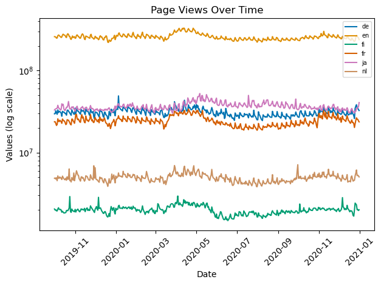
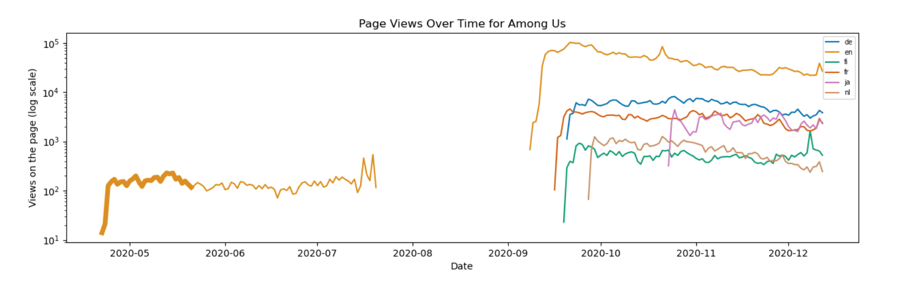
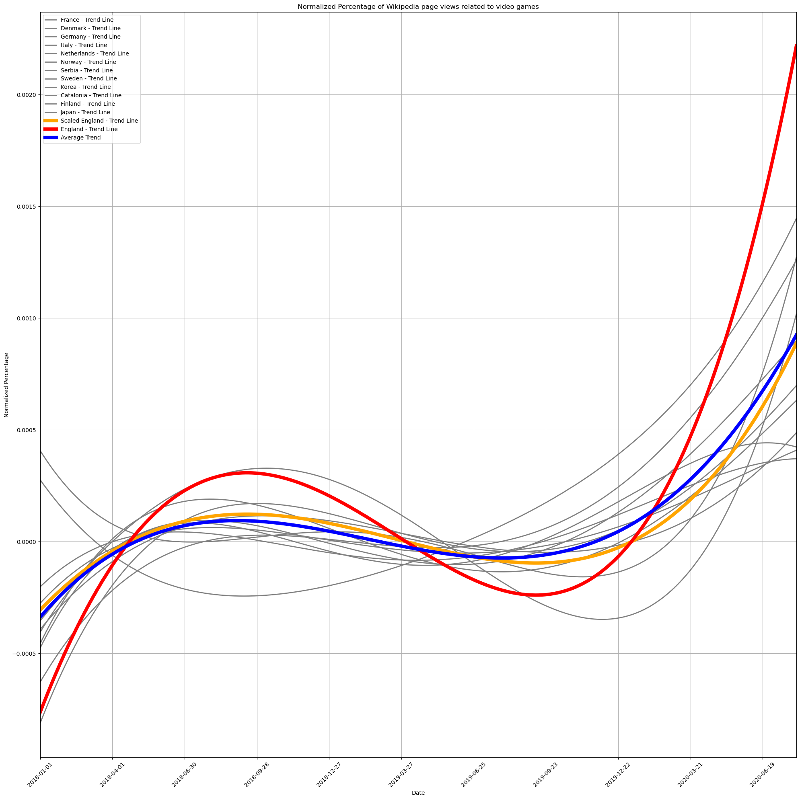
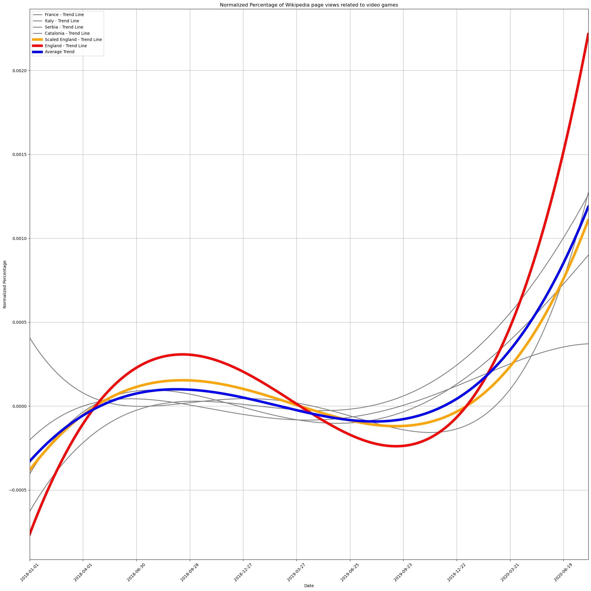
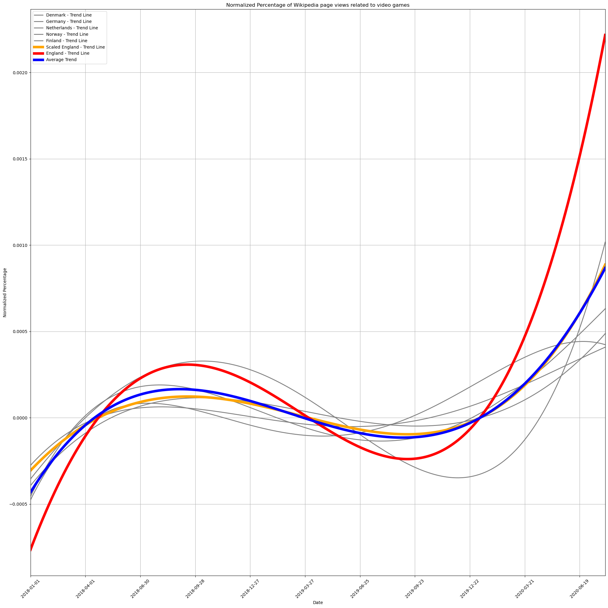
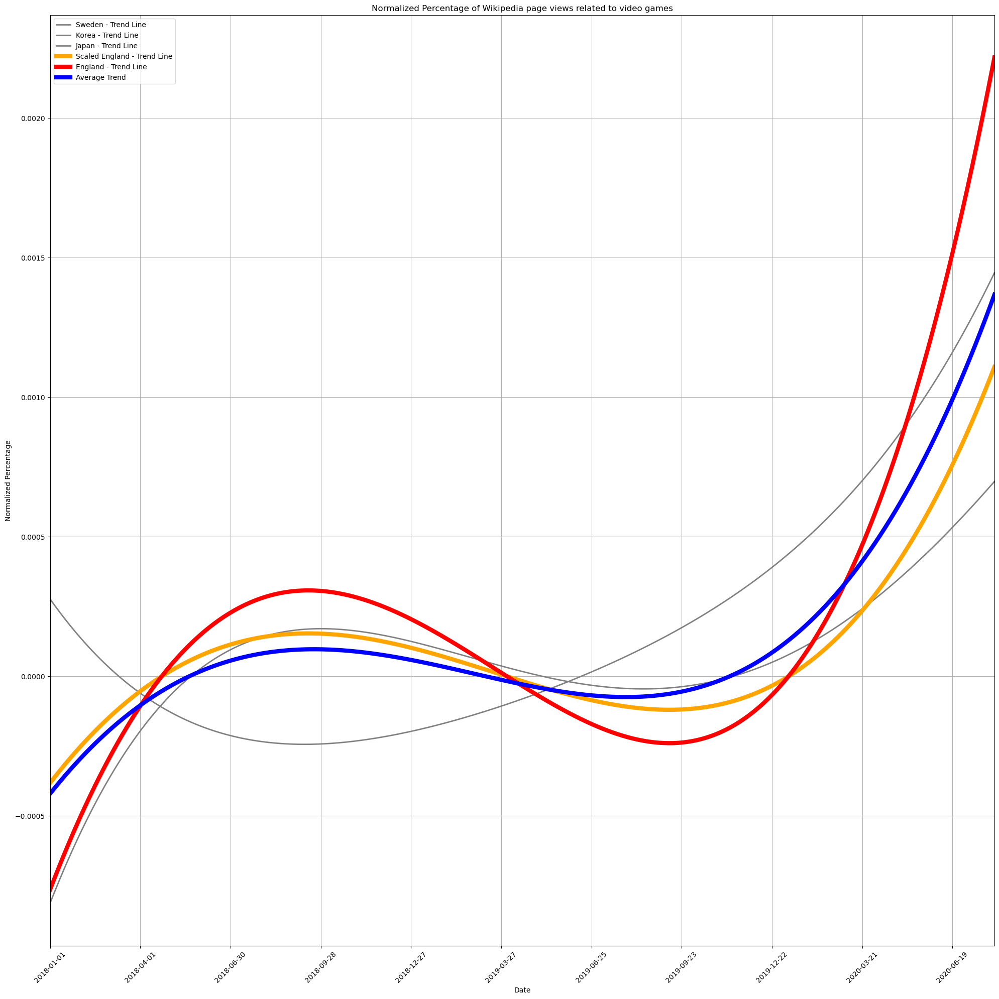
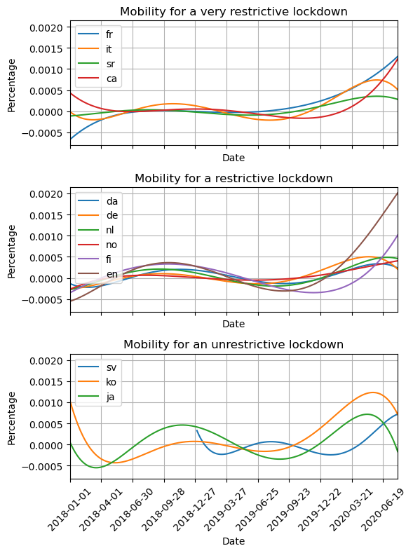

# Data Story

During the COVID-19 lockdown, people had to find other ways to keep themselves occupied, creating a rise in video game popularity. Therefore by analyzing the correlation between the severity of the lockdown with the rise and fall of various game genres, we were able to find many interesting trends. The was done by analyzing the language used in different Wikipedia pages for each game, as well as examining the mobility data in each country to estimate the severity of lockdown.

We will tell a fascinating story about how different types of video games faced tough challenges. We looked at the language of Wikipedia pages and connected them with data about that country's mobility change during the pandemic (for the languages that are mainly spoken in only one country). This helps us see interesting trends. Furthermore, we analyzed if English Wikipedia can show us what's happening worldwide as it is the most used worldwide language. Our story shows how strict lockdowns relate to what video game genres people tend to play more of. We see how the video game industry is changing during global disruptions and if it had a lasting effect on various genres' popularity. This can be useful information for game developers when choosing what game genre to choose, and what target audience to make it for.

We will extract Wikipedia page information that we are interested in, mainly focusing on video game related pages from 2018 to 2020 in order to analyze the changes that the pandemic had on the video game industry.

## To what extent can English Wikipedia pages serve as a reliable estimate of the average video game popularity?

In this section we look at the possibility of english wikipedia pages being able to represent the global average and trend of video games. This is likely as video games are often released in english and do not always have other languages. Furthermore a lot of countries speak english on top of their native languages since english is the most common language worldwide. Studies show that 1.45 billion people speak english, and this encompasses more the higher classes. Therefore the people more likely to have access to video games often speak english, again explaining why english wikipedia pages could serve as a reliable estimate of the average video game popularity.

### Data Exploration / Processing

In order to find out if English Wikipedia pages can serve as a reliable estimate of the average video game popularity, we used the interventions and global mobility datasets in order to find enough relevant information. Later on we used an API to search for more specific games. As we can see wikipedia is accessed a lot, with a little increase during the COVID-19 lockdown period:

We analyzed the differences between pre-lockdown, lockdown, and normalcy of all the data. We looked at the different mobilities, page views, more specifically, page views in comparison to total page views. To find the relevant pages in the interventions dataset, we had to extract culture -> media -> video games, and then look at the percent usage of wikipedia that was associated with video games. We will see below the relationship between the Enlgish Wikipedia pages and the rest.

At first thought, given the amount of people that speak enligsh, as well as most video games originally being created in english would lead us all to believe that the English pages would follow a similar trend to the average wikipedia pages, right? Keep on reading to find out!

### Analysis

Take a look at the graph below, unsurprisingly, the lockdown in Great Britain is not representative of the average mobility. This is to be expected as the lockdowns were decided by every country individually and had nothing to do with their spoken language.

At first glance, the english wikipedia pages do not seem to be a reliable estimate of the average video game popularity of all countries as it has very often the highest or lowest value. However when we scale down the english page views (two and a half times) we end up with the orange curve which is extremely similar to the average. This shows that english wikipedia pages (when toned down) are quite reliable when trying to estimate the global average.

But why are the English Wikipedia pages so much more volatile than the average page views?

Especially during the COVID-19 lockdown, English spiked a lot more than other countries. English is by far the most used language in the video game world for anything competitive. All the professional games are cast in English, so all the viewers and players of high level video games are forced to use English. Furthermore the lockdown allowed everyone that is higher level and passionate about video games to have a lot more time to dedicate to it than previously. Furthermore someone less passionate would most likely not put as much time into video games and would be more likely to spend less of their time online.

Before the COVID-19 lockdown, players often played the same games as they didn't have as much time to put into learning new ones. Since higher levels of video games are english speaking, they don't really need to look up their games on wikipedia as they already know it well enough. However during the lockdown, many new games rose to popularity (Among Us, Fall Guys), and these games pushed people to look them up and learn the new games, therefore the spike in english wikipedia pages during the lockdown. On top of that the people that play more often enjoy playing with add-ons to the games, which are almost always solely in English. However the higher level players tend to always return to their game of choice after the hype of the new games die down.

Among Us is a great example to showcase this. It's not an accident that there is only information about the engish wikipedia searches for Among Us mid-2020. The vast majority of games are created in Enlgish only and they are then only translated into other languages when, but more importantly if they become more popular. Among Us was released mid 2018, however it gained a bit of popularity when the lockdown happened as a lot of people were home with time to play, often wanting to play fun games together, which Among Us clearly is. However even with this increase with wikipedia searches being in the hundreds didn't warrant for the game to be translated into any other languages, and therefore the lack of wikipedia pages for the game in any other language before it blew up.

This really is a great example of how the game has to gain in popularity in english before being translated, as we can see when the game really blew up mid september 2020 reaching hunderds of thousands of wikipedia searches, all the other languages began to exist and rise in popularity too. However this game, even though it was the perfect game for the COVID-19 lockdown in order to both have fun keep contact with friends, it only gained in popularity thanks to youtubers and twitch streamers playing it, making their viewers want to play the game too. Again we can see how the english pages reached higher than other languages, however the searches came down a lot faster too, but by looking at the english pages before the other pages even existed, we could easily predict what would happen with the other wikipedia pages.

Obviously the COVID-19 lockdown increased the page views related to video games, but we can also see below that video games increased more relatively to other pages during the COVID-19 lockdown. This is important because all page views increased as we could see above when we showed the total amount of wikipedia searches. Unfortunately we cannot see the longer lasting effect that COVID-19 had on the pageviews a few years after the lockdown due to the lack of data with this dataset.

Furthermore, when we compare the trends individually, we can still match the english to be the average, no matter how restrictive the lockdown was. However it matches the semi_restrictive lockdowns the best.

This could be due to the fact that england had a semi-restrictive lockdown. But it can still represent the others' averages as many countries use enlish other than england.

## Conclusion

In conclusion, we found that by toning down the English Wikipedia pages, making it less volatile, we can accurately predict the worldwide average Wikipedia pages. Furthermore by looking more closely at specific games, we can see how English is often the first to follow a trend and therefore ride the "hype" longer, but crash more afterwards, explaining why it is often more volatile. English is also very commonly first to follow the "hype" of a new game as newer games are nearly exclusively made in english, and the other languages are added later on if the game takes off.