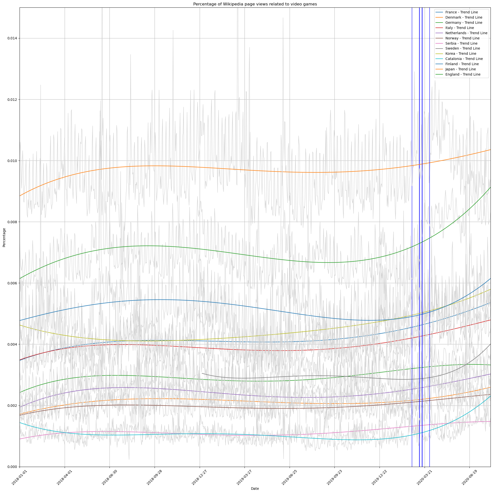

# Data Story

During the COVID-19 lockdown, people had to find other ways to keep themselves occupied, creating a rise in video game popularity. Therefore by analyzing the correlation between the severity of the lockdown with the rise and fall of various game genres, we were able to find many interesting trends. The was done by analyzing the language used in different Wikipedia pages for each game, as well as examining the mobility data in each country to estimate the severity of lockdown.

We will tell a fascinating story about how different types of video games faced tough challenges. We looked at the language of Wikipedia pages and connected them with data about that country's mobility change during the pandemic (for the languages that are mainly spoken in only one country). This helps us see interesting trends. Furthermore, we analyzed if English Wikipedia can show us what's happening worldwide as it is the most used worldwide language. Our story shows how strict lockdowns relate to what video game genres people tend to play more of. We see how the video game industry is changing during global disruptions and if it had a lasting effect on various genres' popularity. This can be useful information for game developers when choosing what game genre to choose, and what target audience to make it for.

We will extract Wikipedia page information that we are interested in, mainly focusing on video game related pages from 2018 to 2020 in order to analyze the changes that the pandemic had on the video game industry.

# To what extent can English Wikipedia pages serve as a reliable estimate of the average video game popularity?

In this section we look at the possibility of english wikipedia pages being able to represent the global average and trend of video games. This is likely as video games are often released in english and do not always have other languages. Furthermore a lot of countries speak english on top of their native languages since english is the most common language worldwide. Studies show that 1.45 billion people speak english, and this encompasses more the higher classes. Therefore the people more likely to have access to video games often speak english, again explaining why english wikipedia pages could serve as a reliable estimate of the average video game popularity.

Take a look at the graph below, unsurprisingly, the lockdown in Great Britain is not representative of the average mobility as can be seen below. This is to be expected as the lockdowns were decided by every country individually and had nothing to do with their language.

At first glance, the english wikipedia pages do not seem to be a reliable estimate of the average video game popularity of all countries as it has very often the highest or lowest value. However when we scale down the english page views (two and a half times) we end up with the orange curve which is extremely similar to the average. This shows that english wikipedia pages (when toned down) are quite reliable when trying to estimate the global average.

Obviously the COVID-19 lockdown increased the page views related to video games, but we can also see below that video games increased more relatively to other pages during the COVID-19 lockdown. Unfortunately we cannot see the longer lasting effect that COVID-19 had on the pageviews a few years after the lockdown due to the lack of data.

Furthermore, when we compare the trends individually, we can still match the english to be the average, no matter how restrictive the lockdown was. However it matches the semi_restrictive the best with a reduction of 2.5, while the reduction had to be adjusted for the restrictive and unrestrictive to 2.

This could be due to the fact that england had a semi-restrictive lockdown. But it can still represent the others' averages as many countries use enlish other than england.

