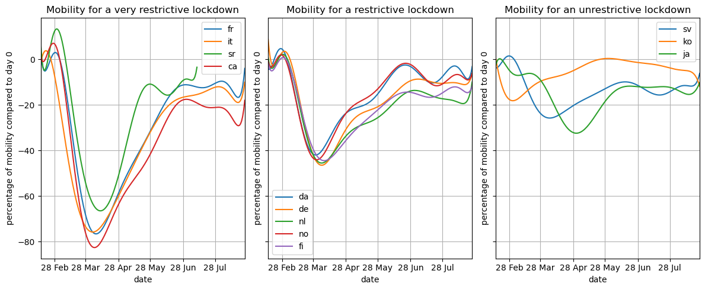

## How Lockdown Affected Attention Towards Video Games

The goal of this project is to analyze how various genres of video games were affected differently and to study the correlation between the interest in different video game genres and the severity of lockdown during COVID-19. This will be achieved by analyzing the language used in different Wikipedia pages for each game, as well as examining mobility data in each country to estimate the severity of lockdown.

In the wake of the COVID-19 pandemic, our project unveils a captivating narrative of how distinct video game genres navigated unprecedented challenges. By scrutinizing language patterns on Wikipedia pages and correlating them with mobility data, we reveal nuanced trends. We explore the reliability of English Wikipedia pages as a global barometer. This concise story not only illuminates the complex relationship between lockdown severity and gaming habits but also provides valuable insights for understanding the evolving dynamics of the video game industry in the face of global disruptions (and the loneliness of people).

### Research Questions:
- Is there a consistent trend for the same genres of video games during the COVID-19 pandemic?
  - Investigate whether certain video game genres experienced similar patterns of popularity or decline during the pandemic.
  - Explore potential factors influencing these trends, such as changes in user preferences, gaming habits, or social dynamics.

- What is the relationship between mobility patterns and the traffic of video game Wikipedia pages?
  - Examine how variations in mobility data, reflecting the severity of lockdown measures, correspond to changes in the viewership of video game Wikipedia pages.
  - Analyze whether increased or decreased mobility aligns with heightened interest in specific video game genres, indicating a potential connection between real-world restrictions and virtual entertainment.

- To what extent can English Wikipedia pages serve as a reliable estimate of the average effect on video game popularity during the pandemic?
  - Assess the generalizability of findings from English Wikipedia pages to global trends, considering cultural and linguistic differences.
  - Explore whether language-specific Wikipedia pages provide consistent insights into the popularity or decline of video game genres, or if there are notable variations that need to be considered in the analysis.

- How did the popularity change in board games compare to online games during the pandemic?

To enrich our insights and provide a nuanced understanding of the observed trends, we have judiciously incorporated additional datasets. These supplementary data sources are instrumental in elucidating the intricate relationship between external factors, such as the global pandemic, and the ebb and flow of interest in different video game titles. These include all the frequency at which Wikipedia pages for each video game in every language was accessed, especially during the COVID-19 pandemic.

We will extend our analysis to more games and more languages, we will study different types of games (solo player, multiplayer, offline, online, campaign, battle royale, etc...) and find the ones with the highest growth of interest. To do this we will create a dataframe that will link each game to different topics (similar to the topics_linked.csv that is part of the coronawiki dataset). By doing that, we will extend our analysis for more languages and study the different types of games.

Most of the data is useful and interesting even though there were some missing values that we found in the dataset for certain wikipedia pages. This is all shown in the notebook. Some interesting findings that have already been done are:
- Not only did the use of wikipedia rise, but video game related pages rose more:

- The countries showed different trends which can be split into three categories:

Causal analysis to be confident in saying that the interest for video games increased during the pandemic/lockdown and that the growth of the interest for the related wikipedia pages is not only due to the global growth of interest for wikipedia (Yichen's work).

### Internal milestones:
- Choosing what video games are a good choice to represent a genre
- Choosing what languages are good due to them being mostly spoken in only one country
- Finding trends for each genre during the pandemic (english wikipedia)
- Finding trends between the mobility dataset and each video game genre
- Creating the story with the findings.
- Create the website for the datastory.
