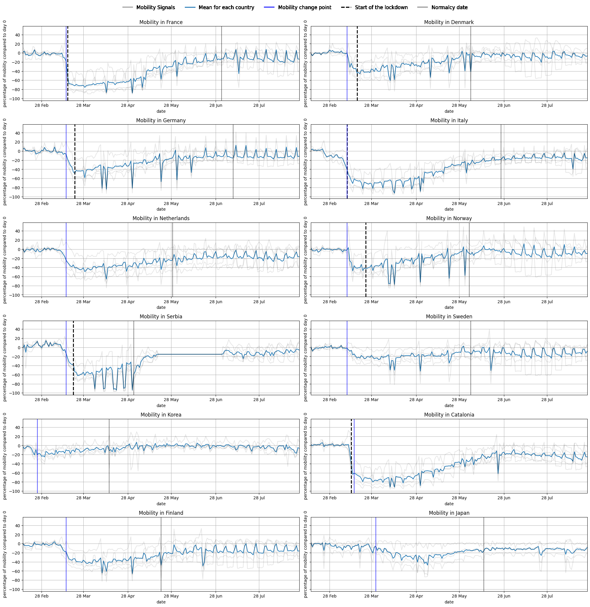
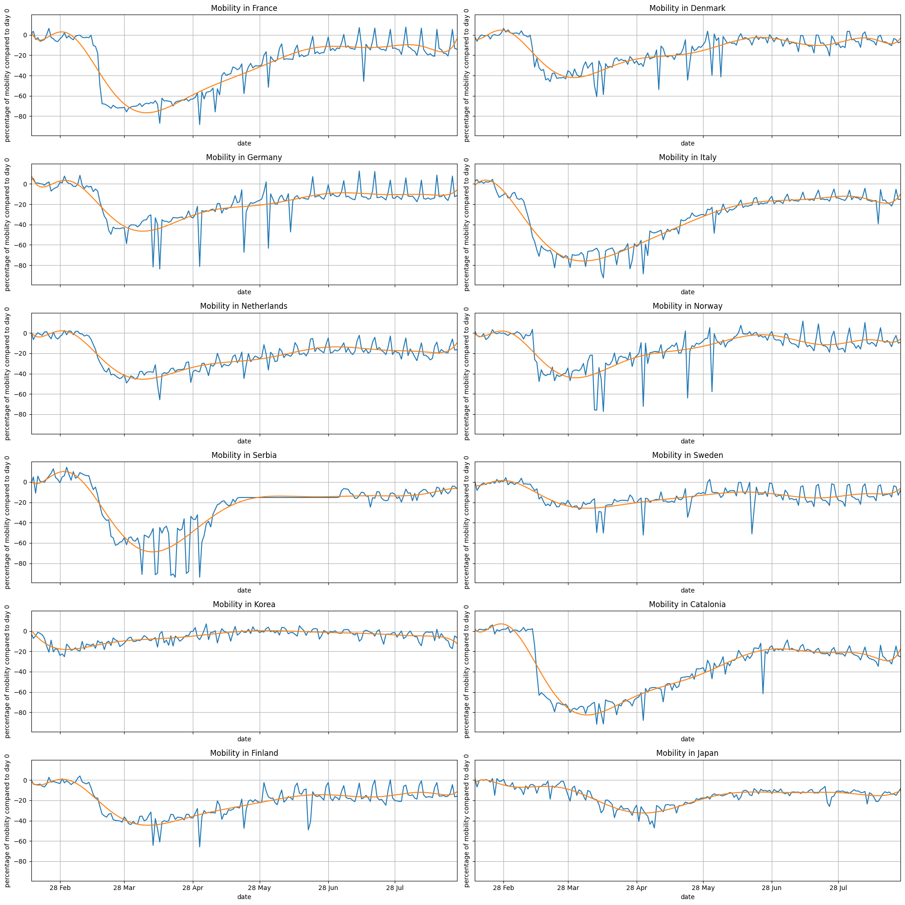
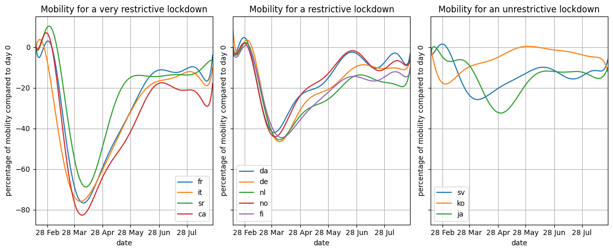
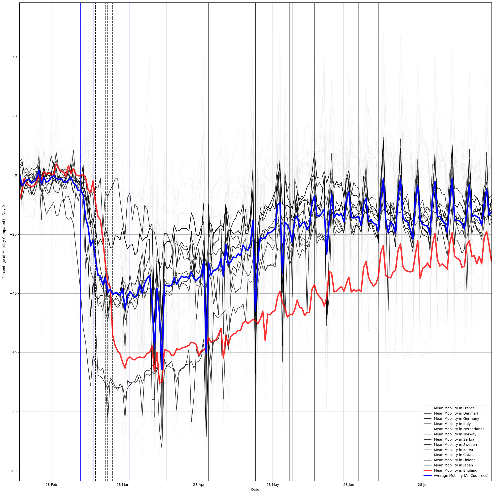
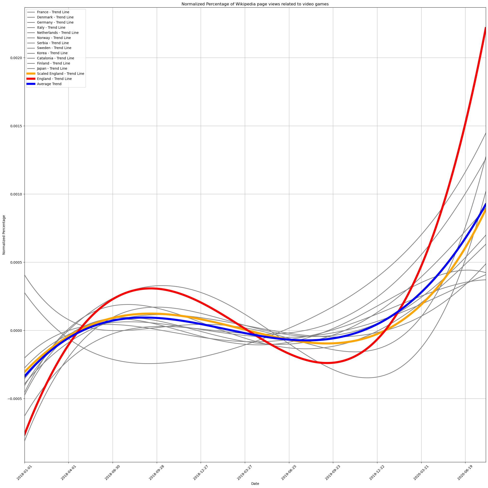
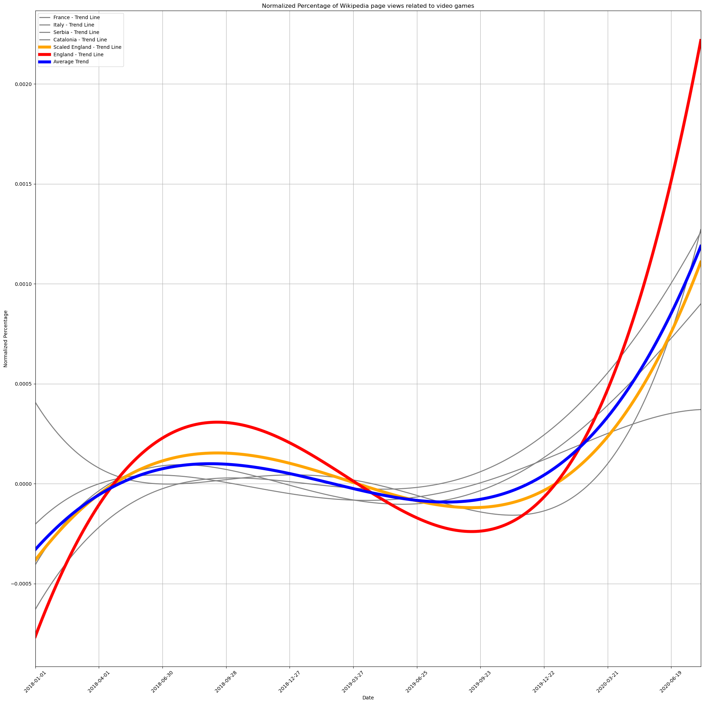
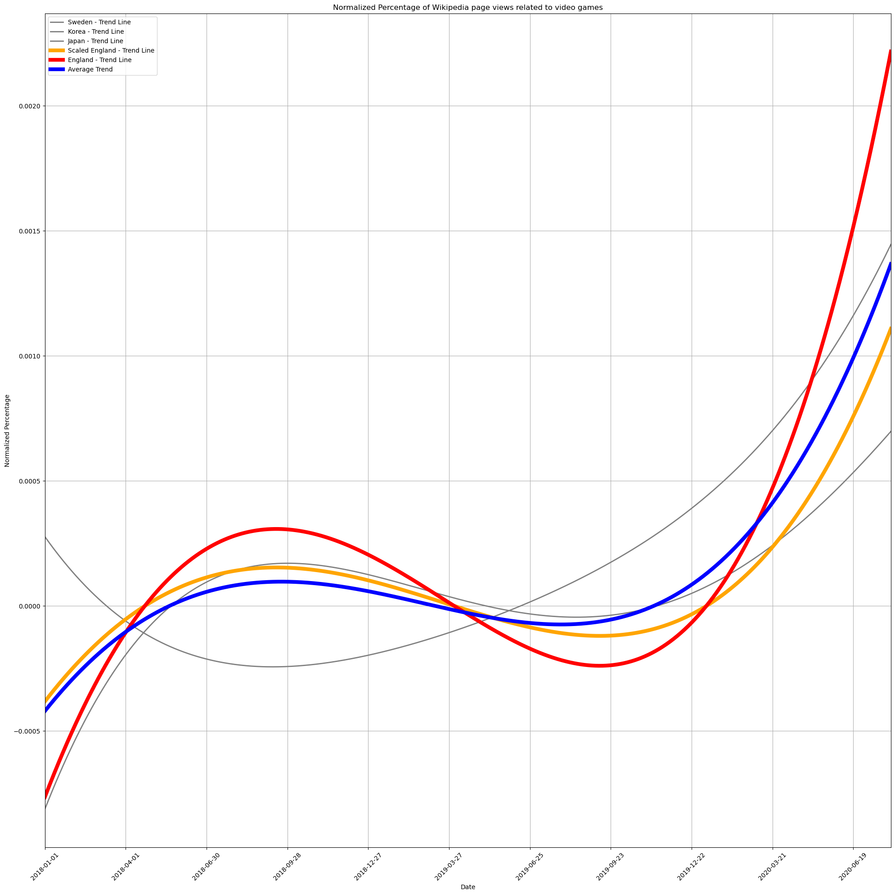

During the COVID-19 lockdown, people had to find other ways to keep themselves occupied, creating a rise in video game popularity. Therefore by analyzing the correlation between the severity of the lockdown with the rise and fall of various game genres, we were able to find many interesting trends. The was done by analyzing the language used in different Wikipedia pages for each game, as well as examining the mobility data in each country to estimate the severity of lockdown.

We will tell a fascinating story about how different types of video games faced tough challenges. We looked at the language of Wikipedia pages and connected them with data about that country's mobility change during the pandemic (for the languages that are mainly spoken in only one country). This helps us see interesting trends. Furthermore, we analyzed if English Wikipedia can show us what's happening worldwide as it is the most used worldwide language. Our story shows how strict lockdowns relate to what video game genres people tend to play more of. We see how the video game industry is changing during global disruptions and if it had a lasting effect on various genres' popularity. This can be useful information for game developers when choosing what game genre to choose, and what target audience to make it for.

In this part we will analyze the mobility change of each country during in the begeinning the year 2020 and the , which corresponds to the Covid-19 period and the first lockdown in most of the countries around the world.

# Mobility pattern
First, to be able to analyze the relationship between mobility and attention towards videogame, we need first to get the mobility data for different country.
\n
The plot below present the average mobility between the 2020-02-15 and the 2020-08-25	for France, Denmark, Germany, Italy, Netehrlands, Norway, Serbia, Sweden, South Korea, Catalonia (Barcelona), Finland and Japan. We also have differents line that present important dates of this period.   

Thus, we can see that for most of the country, the start of the lockdown was really break in the mobility pattern. Indeed, if we take France as an exmaple, the mobility decreased by around 70% after the beginning of the lockdown. However, some countries like Japan the decrease is less likely noticeable.

Therefore, if we want to see if the mobility change has an impact on the attention towards videogames, can't consider all the countries has one group but we need to group them according to thir "lockdown Intensity".

# Clustering countries

The signal of the mobility patterns is very noisy and to be able to grouped them into different cluster we can first smooth the curves by using a polynomial approximation.

Thanks to these new smoothed curves, we can group the countries into 3 different categories of lockdown intensity: very restrictive, restrictive and unrestrictive.

We can see that there are 3 clear tendancies with very similar pattern. We have that France, Italy, Serbia and Catalonia (Barcelona) have had a huge decrease in mobility.

# Attention towards video games

Now that we have grouped the countries thanks to their moblity during the Covid-19 lockdown, we can get a measure of the attention shift towards video games during the same period.

The measures we are going to use to have an insight of the population attention towards video games are wikipedia pageviews related top the same topic. During the lockdown, people were most od the time at home, and thus got more free time than usual, which translate into a higher traffic on the wikipedia website overall. That is why it is not the absolute value of the pageviews that interest us in this section, but the percentage of views on video games related pages amongst all the wikipedia traffic.

The countries with which we chose to do the analysis speak a language that is mainly speaken only in this country. This way we can assume accurately that the mobility in a certain country is linked to the views on a page written in the official language of the country. For example, we can assume that only swedish people are using wikipedia pages written in swedish.

The following figure shows therefore the percentage of wikipedia pageviews related to video games in the same countries we have in the mobility part.

We can see that after the beginning of the lockdown it seems that certain countries experienced a rise in the attention toward video games. To have a better understanding of these curves, we can group them following the clustering we did previously in the mobility context.

# To what extent can English Wikipedia pages serve as a reliable estimate of the average video game popularity?

Unsurprisingly, the lockdown in Great Britain is not representative of the average mobility as can be seen below. This is to be expected as the lockdowns were decided by every country individually and had nothing to do with their language.

At first glance, the english wikipedia pages do not seem to be a reliable estimate of the average video game popularity of all countries as it has very often the highest or lowest value. However when we scale down the english page views (two and a half times) we end up with the orange curve which is extremely similar to the average. This shows that english wikipedia pages (when toned down) are quite reliable when trying to estimate the global average.

Obviously the COVID-19 lockdown increased the page views related to video games, but we can also see below that video games increased more relatively to other pages during the COVID-19 lockdown. Unfortunately we cannot see the longer lasting effect that COVID-19 had on the pageviews a few years after the lockdown due to the lack of data.

Furthermore, when we compare the trends individually, we can still match the english to be the average, no matter how restrictive the lockdown was. However it matches the semi_restrictive the best with a reduction of 2.5, while the reduction had to be adjusted for the restrictive and unrestrictive to 2.

This could be due to the fact that england had a semi-restrictive lockdown. But it can still represent the others' averages as many countries use enlish other than england.

# Bon j'ai changé ce que je veux dire jsp si ca peut etre utile ca dcp je laisse

However when we compare the english pageviews to the average pageviews, it is a lot more similar. The major difference being towards the end when it keeps on increasing compared to the others. Often gamers play in English, while people who play more casually play in their mothertongues. This could explain the dropoff when the mobility returns to normal for other countries and why english wikipedia searches kept increasing even when mobility was returning to normal. Casual players preffered to go and do other activities when mobility rose back up, while gamers kept on playing as they could work from home, even when mobility was increasing.

Now we check compared to each lockdown type:

Here we can see the restrictive lockdowns:

Semi-restrictive lockdowns:

Unrestrictive lockdowns:

Here we can clearly see that post COVID-19, the restrictive lockdowns are the most similar to england as the mobility. This is beacuse more gamers had time to play, increasing the enlish wikipedia gaming pages similarily to a restrictive lockdown, when more people had time to play. However after COVID-19, we can see that the english wikipedia gaming pages differed a lot to the ones of an unresrtictive lockdown as they were the fastest to stop working from home.